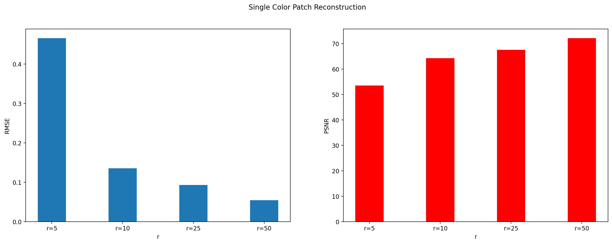

# Image-Reconstruction-using-Matrix-Factorization
Image reconstruction using matrix factorization involves decomposing an image matrix into two or more lower-dimensional matrices whose product approximates the original matrix. This technique is useful because it leverages the inherent structure and patterns within the image data, allowing for more efficient storage, noise reduction, and improved image quality.
# Part-1
Use the above dog's image and reconstruct the image in the following two cases, where your region is-
    
1. a rectangular block of 30X30 is assumed missing from the image. 
    
2. a random subset of 900 (30X30) pixels is missing from the image. 
    
Choose rank `r` yourself. Perform Gradient Descent till convergence, plot the selected regions, original and reconstructed images, and calculate the RMSE and PSNR values. Obtain the reconstruction using RFF + Linear regression and compare the two. 
1. **Region is a rectangular block of 30x30 is assumed missing from the image.**

    - **Using Gradient Descent:**
    
        
        RMSE= 2.8
        
        PSNR= 39.19

        **Observation:** The reconstruction quality is poor in the area where the rectangular block was removed because the algorithm lacks sufficient contextual information to accurately predict missing pixels deep within the removed patch. The quality is slightly better near the boundary pixels of the removed patch because there is some local information available from neighboring pixels. However, as we move deeper into the removed patch, the available information diminishes, leading the algorithm to stretch information from the border pixels. If the missing patch contains only a single color, the reconstruction is relatively good. But if the missing patch contains multiple colors, the reconstruction becomes poorer as the algorithm struggles to accurately fill in the missing information.
    - **Reconstruction using RFF + Linear regression:**
    
        <div style="text-align: center;">
            
        </div>


2. **A random subset of 900 (30x30) pixels is missing from the image.**

    - **Using Gradient Descent:**
    
        

        RMSE= 1.61

        PSNR=44.16
        
        **Observation:** When small portions of pixels are removed randomly and we use gradient descent to factorize matrices W and H with an appropriate rank for matrix decomposition, there's a high likelihood that the removed pixels will have at least one neighboring pixel that is not removed. This means that some information about the removed pixels is retained, resulting in better reconstruction compared to when a whole patch of pixels is removed. This is because the algorithm can use the surrounding pixels to infer missing values, leading to a smoother and more accurate reconstruction.    

    - **Reconstruction using RFF + Linear regression:**
    
        <div style="text-align: center;">
            
        </div>

# Part - 2
***Vary region size (NxN) for ```N = [20, 40, 60, 80]``` and perform Gradient Descent till convergence.*** Again, consider the two cases for your region as mentioned in Part (1). Demonstrate the variation in reconstruction quality by making appropriate plots and metrics. 


1. **Rectangular block of size NxN is assumed to be missing from the image:**

    - **Region of 20x20:**
    
        

    - **Region of 40x40:**
    
        

    - **Region of 60x60:**
    
        

    - **Region of 80x80:**
    
        

    **Observation:** As we increase the size N of the patch to be removed while keeping the rank r constant, the reconstruction quality tends to deteriorate. This is because with a larger patch size, there's a greater proportion of missing pixels within the image. This creates a larger area of missing information, making it more difficult for the algorithm to accurately fill in the gaps. Additionally, as the patch size increases, the algorithm has to interpolate a greater number of missing pixels, which reduces the amount of contextual information available from neighboring pixels. Consequently, the reconstruction becomes poorer in the region of the removed pixels, as the algorithm struggles to capture the complex patterns and structures present in the image. However, it's important to note that the reconstruction quality remains good in the regions of the image that are not affected by the removal of pixels.

2. **Random subset of size NxN is assumed to be missing from the image:**

    - **Region of 20x20:**
    
        

    - **Region of 40x40:**
    
        

    - **Region of 60x60:**
    
        

    - **Region of 80x80:**
    
        

## PSNR (Peak Signal-to-Noise Ratio)

PSNR is a measure used to assess the quality of a reconstructed or compressed image relative to the original image. It quantifies the ratio between the maximum possible power of a signal and the power of the noise that affects the fidelity of its representation.

### Formula
The formula for PSNR is:

$$
\text{PSNR} = 10 \cdot \log_{10} \left( \frac{{\text{MAX}^2}}{{\text{MSE}}} \right)
$$

Where:
- **MAX**: Maximum possible pixel value of the image (e.g., 255 for an 8-bit grayscale image).
- **MSE**: Mean Squared Error, calculated as the average of the squared differences between corresponding pixels in the original and reconstructed images.

### Interpretation
PSNR is typically expressed in decibels (dB). A higher PSNR value indicates higher image quality, meaning less distortion or noise in the reconstructed image compared to the original.

### PSNR Graph of Randomly Removed Pixels and Missing Patch

<div style="text-align: center;">
    
</div>

- **Observation**:From the PSNR graph comparing randomly removed points and patch removed points, we observe that the PSNR value for randomly removed points is higher. As we increase the size of the removed points (NxN) from 20 to 80, the PSNR value decreases slightly. However, for patch removed points, the PSNR value for subsequent sizes is smaller compared to randomly removed points. Moreover, as we increase the size (N) of the removed patch, the PSNR value decreases significantly, indicating poorer reconstruction quality.

- **Conclusion**:

    1. Randomly removing points results in higher PSNR values, indicating better reconstruction quality compared to patch removal.

    2. Increasing the size of the removed patch leads to a significant decrease in PSNR values compare to randomly removed points, suggesting a notable decline in reconstruction quality.


## Root Mean Squared Error (RMSE)

RMSE, or Root Mean Squared Error, is a metric used to measure the average difference between corresponding pixel intensities in the original image and the reconstructed image. It provides a single numerical value that quantifies the overall discrepancy between the two images.

### Formula
The formula for RMSE is:

$$
RMSE = \sqrt{\frac{1}{N} \sum_{i=1}^{N} (I_{\text{orig}}(i) - I_{\text{recon}}(i))^2}
$$

Where:
- **N**: Total number of pixels in the image.
- **I_orig(i)**: Intensity of the i-th pixel in the original image.
- **I_recon(i)**: Intensity of the i-th pixel in the reconstructed image.

### Interpretation
- **Lower RMSE**: A lower RMSE value indicates that the reconstructed image closely matches the original image, with minimal differences between pixel intensities. This suggests a high level of accuracy in the reconstruction process and reflects a high-quality reconstruction.
  
- **Higher RMSE**: Conversely, a higher RMSE value indicates a greater discrepancy between the original and reconstructed images. This suggests that the reconstruction process has not accurately captured the details or patterns present in the original image, resulting in a lower-quality reconstruction.

### RMSE Graph of Randomly Removed Pixels and Missing Patch

<div style="text-align: center;">
    
</div>

- **Observation**: From the RMSE plots comparing patch (NxN) removed and randomly removed points (of size NxN), it's evident that the RMSE value for the patch removed is higher than for randomly removed points. As we increase the size (N) of the removed patch, the RMSE value increases significantly, indicating a substantial deterioration in reconstruction quality. On the other hand, for randomly removed points, the RMSE value remains almost constant as N increases. This suggests that the reconstruction quality for randomly removed points is relatively stable across different sizes, whereas the reconstruction quality for patch removed points deteriorates significantly as the size of the removed patch increases.

- **Conclusion**:

    1. Patch removal results in poorer reconstruction quality compared to randomly removed points.

    2. Larger removed patch sizes lead to significantly higher RMSE values, emphasizing the detrimental effect of larger missing areas on reconstruction quality.


# Part - 3
Data Compression-
Here, ground truth pixel values are not missing- you have access to them. You want to explore the use of matrix factorisation in order to store them more efficiently.

- Consider an image patch of size (NxN) where N=50. We are trying to compress this patch (matrix) into two matrices, by using low-rank matrix factorization. Consider the following three cases-
    1. a patch with mainly a single color.
    2. a patch with 2-3 different colors.
    3. a patch with at least 5 different colors.

Vary the low-rank value as ```r = [5, 10, 25, 50]```  for each of the cases. Use Gradient Descent and plot the reconstructed patches over the original image (retaining all pixel values outside the patch, and using your learnt compressed matrix in place of the patch) to demonstrate difference in reconstruction quality. Write your observations. 

<br>

Here is a reference set of patches chosen for each of the 3 cases from left to right. 

<div style="display: flex;">
  
  
  
</div>

<br>
## Regions Containing Mainly Single Color

### Vary rank (r) for r = [5, 10, 25, 50] and perform Gradient Descent till convergence.

#### 1. r = 5    


#### 2. r = 10    


#### 3. r = 25    


#### 4. r = 50    


- **Observation**: As we increase the rank (r) for matrix factorization, the reconstruction quality improves, as evidenced by the reduction in artifacts and the better preservation of the original image's structure and patterns. This is because a higher rank allows for a more accurate capture of the underlying structure and patterns in the image, leading to a more faithful reconstruction. Additionally, the PSNR and RMSE values improve as the rank increases, indicating better reconstruction quality and a closer match between the original and reconstructed images.

### PSNR and RMSE for Regions Containing Mainly Single Color

<div style="text-align: center;">
    
</div>

- **Observation**: The PSNR and RMSE plots show that as the rank (r) increases, the PSNR value improves, indicating better reconstruction quality. Similarly, the RMSE value decreases, reflecting a closer match between the original and reconstructed images. This suggests that a higher rank leads to a more accurate capture of the underlying structure and patterns in the image, resulting in a higher-quality reconstruction.

- **Conclusion**:

    1. Increasing the rank (r) for matrix factorization leads to better reconstruction quality for regions containing mainly single colors.

    2. Higher ranks result in improved PSNR and RMSE values, indicating a closer match between the original and reconstructed images and better preservation of the image's structure and patterns.

## Regions Containing 2-3 Different Colors

### Vary rank (r) for r = [5, 10, 25, 50] and perform Gradient Descent till convergence.

#### 1. r = 5    


#### 2. r = 10    


#### 3. r = 25    


#### 4. r = 50    


### PSNR and RMSE for Regions Containing 2-3 Different Colors

<div style="text-align: center;">
    
</div>

## Regions Containing at Least 5 Different Colors

### Vary rank (r) for r = [5, 10, 25, 50] and perform Gradient Descent till convergence.

#### 1. r = 5    


#### 2. r = 10    


#### 3. r = 25    


#### 4. r = 50    


### PSNR and RMSE for Regions Containing at Least 5 Different Colors

<div style="text-align: center;">
    
</div>


## Variation in r
We can see that for low value of r the reconstruction of the patch is not that good. But as we increase the value of r the model tries to fit the patch very well and give the reconstruction pretty good. This observaation can be verified by the RMSE and PSNR plot.

